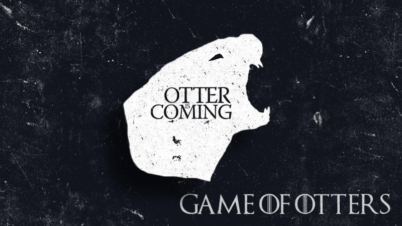

Lootr
=====

A simple RPG-like looting system.

Heavily inspired from http://journal.stuffwithstuff.com/2014/07/05/dropping-loot



Adding items
=====

Lootr is organized as a tree. Get a new instance with

```javascript
var loot = new Lootr('/equipment')

loot.add({ name: 'Stuff' })
```

Each level is composed by a list of items in `loot.items` and nested branchs in `loot.branchs`.

Organize the loot repository by adding branchs

```javascript
loot.branch('weapons')
loot.branch('armor')
```

The `branch` method returns itself, on which you can `add` items or nested branchs.

```javascript
loot.branch('/equipment/weapons')
    .add({ name: 'Pistol' })
    .branch('automatic')
        .add({ name: 'Uzi' })

loot.branch('/equipment/armor')
    .add({ name: 'Plates' })
    .add({ name: 'Leather' })
```

Rollin'
=====

Random-pick something at top level with `Lootr.roll( path, depth = 0, chance = 1 )`

It will yield an item in the `path` branch or, if `depth` is given, in an up to `depth` deep branchs, if the depth-decreasing `chance` is greater than a `Math.random()`

```javascript
// Loot something from top level
loot.roll('/equipment')                        // only 'Stuff'

// Loot something from anywhere
loot.roll('/equipment', Infinity, Infinity)    // any item

// Loot an armor
loot.roll('/equipment/armor')                  // one of [ 'Plates', 'Leather' ]

// Loot a weapon
loot.roll('/equipment/weapons', 3)             // one of [ 'Pistol', 'Uzi' ]

```

Lootin'
=====

Loot against a loot table, described by a definition array like the following. The string stack value allow random stacks in the specified range.

```javascript
deadMonster.drops = [
    {from: '/equipment',         luck:1.0, stack:1 },
    {from: '/equipment/armor',   luck:0.5, stack:2 },
    {from: '/equipment/weapons', luck:0.8, stack:'2-10' }
]

// Loot your reward from a dead monster
var rewards = loot.loot(deadMonster.drops)

rewards = [ {name:'Stuff'}, {name:'Plates'}, {name:'Uzi'}, {name:'Uzi'} ]
```

Modifiers
=====
The library includes a basic modifiers system.

Add some modifiers to affect the properties of each looted item with `addModifiers`.
* `name` modifier will be used as simple suffixes. Or, if it contains one or more `$property`, each property name will be replaced.
* other properties will be handled as the following
```javascript
loot.add({ name: 'Staff', color: 'golden' })
loot.addModifiers([
    { name:    'from the shadows' },
    { name:    'A $color $name from the gods' },
    { agility: 5 },
    { force:   '*2' },
    { intell:  '2-10' },
    { name:    'A $color $name from the gods', force: '+4' }
])
```

Then, at loot time:
```javascript
deadMonster.drops = [
    {from: '/equipment', stack:2, modify:true }
]

// Loot your reward from a dead monster
var rewards = loot.loot(deadMonster.drops)

rewards = [
    // some of these could drop
    {name:'Staff from the shadows'},
    {name:'Staff', intell: 6},
    {name:'A golden staff from the gods'},
    {name:'A golden staff from the gods', force:4 }
]
```

Tests
=====

A simple test suite is available [here](http://vincent.github.io/lootr/test.html)

It also works with `npm test`

